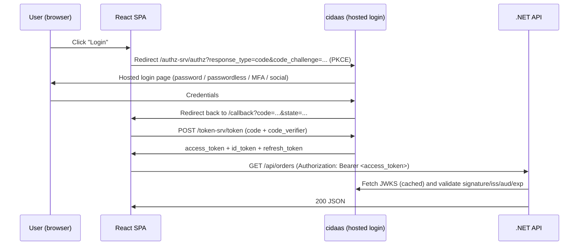

# Authenticating a React + .NET app with cidaas

CIDAAS is a standards-compliant **OAuth 2.0 / OpenID Connect** provider. That is the key
insight: you do **not** need anything cidaas-proprietary. Any OIDC client library works.
This guide uses the standard approach first, then shows the official cidaas SDK as an
alternative.

---

## 1. The architecture you want



**Roles of each piece**

| Piece | Responsibility |
| --- | --- |
| React SPA | Public client. Authorization Code + **PKCE**. Never holds a client secret. |
| .NET API | Resource server. Stateless JWT bearer validation. Issues nothing. |
| cidaas | Authorization server. Owns login UI, MFA, sessions, users, roles. |

> **Never** use the Implicit flow or Resource Owner Password flow. Both are deprecated.

---

## 2. Set up cidaas

Sign in to the cidaas Admin UI (service portal, e.g. `https://EXAMPLE-TENANT.cidaas.eu/admin`
or via https://cspace.cidaas.com).

### 2.1 Register the React app

**Apps → Create New App**

| Field | Value |
| --- | --- |
| Client Type / Template | `SINGLE_PAGE` (public client) |
| Flows / Grant types | `authorization_code`, `refresh_token` |
| Response types | `code` |
| Redirect URLs | `http://localhost:5173/callback`, `https://app.example.com/callback` |
| Post-logout redirect URLs | `http://localhost:5173/`, `https://app.example.com/` |
| Allowed web origins (CORS) | `http://localhost:5173`, `https://app.example.com` |
| Allowed scopes | `openid profile email roles` + your API scope |
| PKCE | Enabled, `S256` |

Copy the **Client ID**. A single-page app must have **no client secret**.

### 2.2 Register the .NET API

Create a second app of type **`SINGLE_PAGE`/`NON_INTERACTIVE`** (or a dedicated
resource/scope entry, depending on your tenant's UI version). What matters is:

1. Under **Scope Management**, create a scope group + scope, e.g. `myapi` with scopes
   `myapi:read`, `myapi:write`.
2. Add those scopes to the React app's **allowed scopes** so the SPA can request them.

### 2.3 Find your endpoints

Everything is published at the discovery document — always read it rather than
hardcoding paths:

```
https://EXAMPLE-TENANT.cidaas.eu/.well-known/openid-configuration
```

Typical cidaas values:

| Purpose | Endpoint |
| --- | --- |
| Issuer / authority | `https://<tenant>.cidaas.eu` |
| Authorization | `https://<tenant>.cidaas.eu/authz-srv/authz` |
| Token | `https://<tenant>.cidaas.eu/token-srv/token` |
| JWKS | listed as `jwks_uri` in the discovery doc |
| UserInfo | listed as `userinfo_endpoint` |
| End session | listed as `end_session_endpoint` |

---

## 3. React: Authorization Code + PKCE

### Option A (recommended): `react-oidc-context`

Battle-tested, maintained, framework-agnostic under the hood (`oidc-client-ts`).

```bash
npm i oidc-client-ts react-oidc-context
```

**`.env`**

```ini
VITE_CIDAAS_AUTHORITY=https://EXAMPLE-TENANT.cidaas.eu
VITE_CIDAAS_CLIENT_ID=YOUR-SPA-CLIENT-ID
VITE_API_BASE=https://localhost:7001
```

**`src/auth/oidcConfig.ts`**

```ts
import { WebStorageStateStore, type UserManagerSettings } from "oidc-client-ts";

export const oidcConfig: UserManagerSettings = {
  authority: import.meta.env.VITE_CIDAAS_AUTHORITY,
  client_id: import.meta.env.VITE_CIDAAS_CLIENT_ID,
  redirect_uri: `${window.location.origin}/callback`,
  post_logout_redirect_uri: window.location.origin,
  response_type: "code",
  scope: "openid profile email roles myapi:read myapi:write",

  // PKCE is on by default for response_type=code in oidc-client-ts.
  // Keep tokens out of localStorage; sessionStorage limits XSS blast radius.
  userStore: new WebStorageStateStore({ store: window.sessionStorage }),

  automaticSilentRenew: true,
  monitorSession: false,
};
```

**`src/main.tsx`**

```tsx
import { AuthProvider } from "react-oidc-context";
import { oidcConfig } from "./auth/oidcConfig";

createRoot(document.getElementById("root")!).render(
  <AuthProvider
    {...oidcConfig}
    onSigninCallback={() =>
      // Strip ?code=&state= from the URL after the exchange.
      window.history.replaceState({}, document.title, window.location.pathname)
    }
  >
    <App />
  </AuthProvider>
);
```

**`src/auth/RequireAuth.tsx`**

```tsx
import { useAuth } from "react-oidc-context";
import { useEffect, type PropsWithChildren } from "react";

export function RequireAuth({ children }: PropsWithChildren) {
  const auth = useAuth();

  useEffect(() => {
    if (!auth.isLoading && !auth.isAuthenticated && !auth.activeNavigator) {
      void auth.signinRedirect({ state: { returnTo: window.location.pathname } });
    }
  }, [auth]);

  if (auth.isLoading) return <p>Loading…</p>;
  if (auth.error) return <p>Auth error: {auth.error.message}</p>;
  return auth.isAuthenticated ? <>{children}</> : null;
}
```

**Login / logout buttons**

```tsx
const auth = useAuth();

<button onClick={() => auth.signinRedirect()}>Log in</button>

{/* cidaas hosted registration: same authorize endpoint, view_type=register */}
<button onClick={() => auth.signinRedirect({ extraQueryParams: { view_type: "register" } })}>
  Sign up
</button>

<button onClick={() => auth.signoutRedirect()}>Log out</button>

<span>{auth.user?.profile.email}</span>
```

**Calling the API**

```ts
// src/api/client.ts
import type { User } from "oidc-client-ts";

function currentUser(): User | null {
  const key = `oidc.user:${import.meta.env.VITE_CIDAAS_AUTHORITY}:${import.meta.env.VITE_CIDAAS_CLIENT_ID}`;
  const raw = sessionStorage.getItem(key);
  return raw ? User.fromStorageString(raw) : null;
}

export async function apiFetch(path: string, init: RequestInit = {}) {
  const token = currentUser()?.access_token;
  const res = await fetch(`${import.meta.env.VITE_API_BASE}${path}`, {
    ...init,
    headers: {
      ...init.headers,
      "Content-Type": "application/json",
      ...(token ? { Authorization: `Bearer ${token}` } : {}),
    },
  });
  if (res.status === 401) throw new Error("Unauthorized");
  if (!res.ok) throw new Error(`API ${res.status}`);
  return res.json();
}
```

Inside components you can skip the storage lookup and just use `useAuth().user?.access_token`.

### Option B: the official `cidaas-javascript-sdk`

Use this when you want cidaas-specific features beyond plain OIDC: embedded/custom
login forms, MFA enrolment, consent management, device management, ID validation.

```bash
npm i cidaas-javascript-sdk
```

```ts
import {
  ConfigUserProvider,
  AuthenticationService,
  type OidcSettings,
} from "cidaas-javascript-sdk";

const options: OidcSettings = {
  authority: "https://EXAMPLE-TENANT.cidaas.eu",
  client_id: "YOUR-SPA-CLIENT-ID",
  redirect_uri: `${window.location.origin}/callback`,
  post_logout_redirect_uri: window.location.origin,
  response_type: "code",
  scope: "openid profile email roles myapi:read",
};

const configUserProvider = new ConfigUserProvider(options);
export const authService = new AuthenticationService(configUserProvider);

// Login → hosted page
authService.loginWithBrowser();

// Registration → hosted page
authService.registerWithBrowser();

// On /callback
const user = await authService.loginCallback();   // returns tokens + profile

// Anywhere
const stored = await authService.getUserInfoFromStorage();
await authService.logout();
```

The SDK wraps `oidc-client-ts`, so `OidcSettings` accepts every `UserManagerSettings`
property (including `userStore`, `automaticSilentRenew`).

---

## 4. .NET API: validate the JWT

```bash
dotnet add package Microsoft.AspNetCore.Authentication.JwtBearer
```

**`appsettings.json`**

```json
{
  "Cidaas": {
    "Authority": "https://EXAMPLE-TENANT.cidaas.eu",
    "Audience": "your-api-client-id"
  },
  "Cors": { "AllowedOrigins": [ "http://localhost:5173", "https://app.example.com" ] }
}
```

**`Program.cs`**

```csharp
using Microsoft.AspNetCore.Authentication.JwtBearer;
using Microsoft.IdentityModel.Tokens;

var builder = WebApplication.CreateBuilder(args);

var authority = builder.Configuration["Cidaas:Authority"]!;
var audience  = builder.Configuration["Cidaas:Audience"]!;

builder.Services
    .AddAuthentication(JwtBearerDefaults.AuthenticationScheme)
    .AddJwtBearer(options =>
    {
        // Discovery doc + JWKS are fetched and cached automatically.
        options.Authority = authority;
        options.Audience = audience;
        options.RequireHttpsMetadata = true;
        options.MapInboundClaims = false;   // keep raw OIDC claim names (sub, roles)

        options.TokenValidationParameters = new TokenValidationParameters
        {
            ValidateIssuer = true,
            ValidIssuer = authority,
            ValidateAudience = true,
            ValidAudience = audience,
            ValidateLifetime = true,
            ValidateIssuerSigningKey = true,
            ClockSkew = TimeSpan.FromSeconds(30),
            NameClaimType = "sub",
            RoleClaimType = "roles"          // cidaas emits roles as a "roles" array
        };
    });

builder.Services.AddAuthorization(options =>
{
    options.AddPolicy("ReadOrders", p => p.RequireClaim("scope", "myapi:read"));
    options.AddPolicy("AdminOnly",  p => p.RequireRole("ADMIN"));
});

builder.Services.AddCors(o => o.AddPolicy("spa", p => p
    .WithOrigins(builder.Configuration.GetSection("Cors:AllowedOrigins").Get<string[]>()!)
    .WithHeaders("Authorization", "Content-Type")
    .WithMethods("GET", "POST", "PUT", "PATCH", "DELETE")));

builder.Services.AddControllers();

var app = builder.Build();

app.UseHttpsRedirection();
app.UseCors("spa");
app.UseAuthentication();
app.UseAuthorization();
app.MapControllers();

app.Run();
```

**A protected endpoint**

```csharp
[ApiController]
[Route("api/[controller]")]
[Authorize]
public class OrdersController : ControllerBase
{
    [HttpGet]
    [Authorize(Policy = "ReadOrders")]
    public IActionResult Get()
    {
        var userId = User.FindFirstValue("sub");
        var email  = User.FindFirstValue("email");
        return Ok(new { userId, email });
    }

    [HttpDelete("{id}")]
    [Authorize(Policy = "AdminOnly")]
    public IActionResult Delete(string id) => NoContent();
}
```

### Claim shape gotchas

cidaas tokens vary slightly by tenant configuration. **Decode a real access token**
(paste into https://jwt.io) before you finalise `ValidAudience` and `RoleClaimType`:

- `aud` may be the API client ID, an array, or the SPA client ID. Match it exactly.
- `scope` may arrive as a single space-delimited string. If so, `RequireClaim("scope", "myapi:read")`
  will fail — use a custom requirement instead:

```csharp
options.AddPolicy("ReadOrders", p => p.RequireAssertion(ctx =>
    ctx.User.FindAll("scope")
        .SelectMany(c => c.Value.Split(' ', StringSplitOptions.RemoveEmptyEntries))
        .Contains("myapi:read")));
```

- `roles` may be nested or named `cidaas_roles` / `groups`. Adjust `RoleClaimType`
  or add a claims transformation.

---

## 5. Logout

Local sign-out is not enough — the cidaas session cookie must be cleared too, or the
next login silently re-authenticates.

```ts
auth.signoutRedirect(); // hits end_session_endpoint with id_token_hint, then returns
                        // to post_logout_redirect_uri
```

Make sure `post_logout_redirect_uri` is whitelisted in the cidaas app config.

---

## 6. Token refresh

`automaticSilentRenew: true` uses the refresh token to renew the access token in the
background. For this to work:

- `refresh_token` grant must be enabled on the cidaas app,
- `offline_access` may need to be in your scopes (check your tenant),
- handle the renewal failure event:

```ts
auth.events.addUserSignedOut(() => auth.removeUser());
auth.events.addSilentRenewError(() => auth.signinRedirect());
```

---

## 7. Security checklist

- [x] Authorization Code + **PKCE (S256)**; no implicit flow, no client secret in the SPA.
- [x] Exact-match redirect URIs — no wildcards.
- [x] `state` and `nonce` validated (the library does this; don't disable it).
- [x] Tokens in `sessionStorage` or memory, **not** `localStorage`. Memory-only
      (`InMemoryWebStorage`) is strongest but loses the session on refresh.
- [x] Short access-token lifetime (5–15 min); rely on refresh.
- [x] API validates **signature, issuer, audience, lifetime** — all four.
- [x] Never trust the `id_token` on the API. It is for the client. Authorise on the
      `access_token` only.
- [x] Never make authorisation decisions in React. UI hiding is cosmetic; the API
      is the enforcement point.
- [x] Explicit CORS origin allow-list; no `AllowAnyOrigin` with credentials.
- [x] HTTPS everywhere, including in development if possible.
- [x] Enable MFA / risk-based auth in cidaas rather than building it yourself.

---

## 8. Want maximum security? Use a BFF

Any browser-stored token is exposed to XSS. The hardened pattern is
**Backend-for-Frontend**: the .NET app becomes a confidential OIDC client, holds the
tokens server-side, and gives the SPA only a `HttpOnly; Secure; SameSite=Strict` cookie.

```csharp
builder.Services.AddAuthentication(o =>
{
    o.DefaultScheme = CookieAuthenticationDefaults.AuthenticationScheme;
    o.DefaultChallengeScheme = OpenIdConnectDefaults.AuthenticationScheme;
})
.AddCookie(o =>
{
    o.Cookie.HttpOnly = true;
    o.Cookie.SecurePolicy = CookieSecurePolicy.Always;
    o.Cookie.SameSite = SameSiteMode.Strict;
})
.AddOpenIdConnect(o =>
{
    o.Authority = authority;
    o.ClientId = "your-web-client-id";
    o.ClientSecret = builder.Configuration["Cidaas:ClientSecret"]; // from a secret store
    o.ResponseType = "code";
    o.UsePkce = true;
    o.SaveTokens = true;
    o.GetClaimsFromUserInfoEndpoint = true;
    o.Scope.Clear();
    foreach (var s in new[] { "openid", "profile", "email", "roles", "offline_access" })
        o.Scope.Add(s);
});
```

Register this app in cidaas as a **regular web app** (confidential client) with redirect
URI `https://api.example.com/signin-oidc`. Serve the React build from the same origin,
and add antiforgery protection for state-changing requests.

Trade-off: you give up a pure static SPA deployment and gain immunity to token theft
via XSS.

---

## 9. Debugging

| Symptom | Likely cause |
| --- | --- |
| `redirect_uri_mismatch` | URI not whitelisted, or trailing-slash difference |
| CORS error on `/token-srv/token` | Origin not in cidaas "allowed web origins" |
| 401 with a valid-looking token | `aud` mismatch — decode the token and compare |
| `IDX10501: Signature validation failed` | Wrong `Authority`, or JWKS cache stale |
| 403 on a role-protected route | `RoleClaimType` doesn't match the actual claim name |
| Infinite redirect loop | `onSigninCallback` not stripping `?code=` from the URL |

Enable verbose logs while integrating:

```jsonc
// appsettings.Development.json
"Logging": { "LogLevel": { "Microsoft.AspNetCore.Authentication": "Debug" } }
```

```ts
import { Log } from "oidc-client-ts";
Log.setLogger(console);
Log.setLevel(Log.DEBUG);
```

---

## References

- cidaas docs: https://docs.cidaas.com/
- OAuth2 / OIDC guide: https://docs.cidaas.com/guides/authentication-authorisation/oauth2/basics
- cidaas JavaScript SDK: https://github.com/cidaas/cidaas-javascript-sdk
- `react-oidc-context`: https://github.com/authts/react-oidc-context
- `oidc-client-ts`: https://authts.github.io/oidc-client-ts/
- OAuth 2.0 for Browser-Based Apps (BCP): https://datatracker.ietf.org/doc/html/draft-ietf-oauth-browser-based-apps
